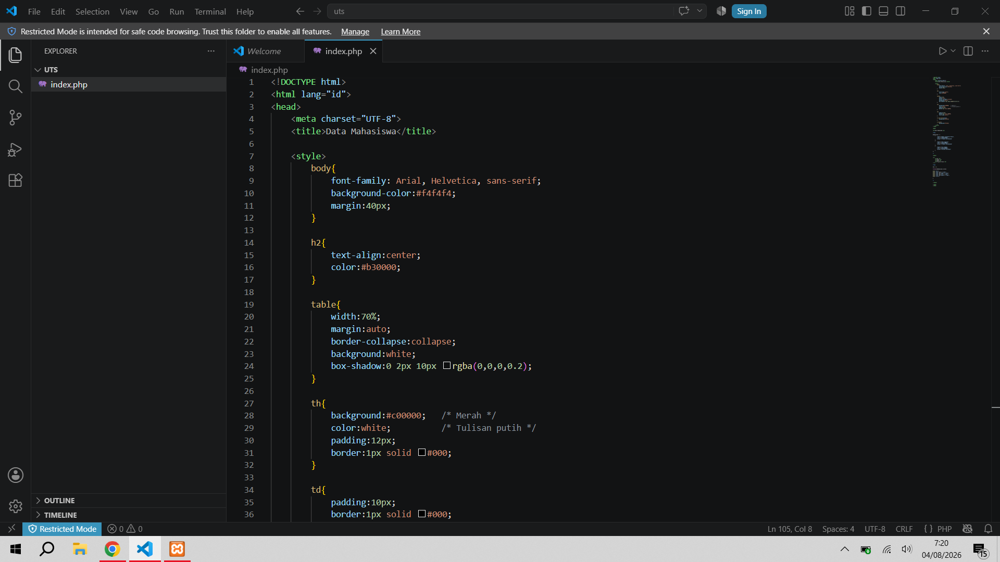
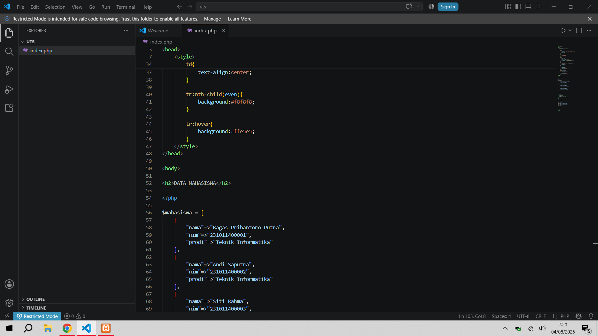
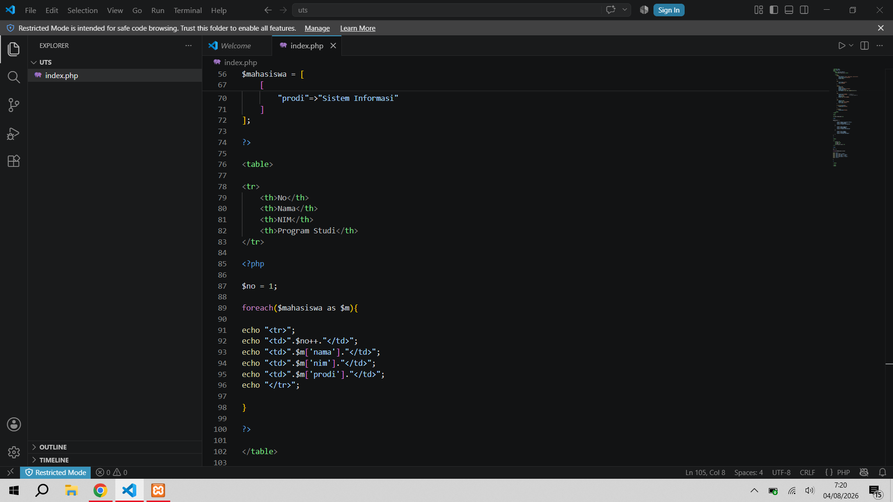
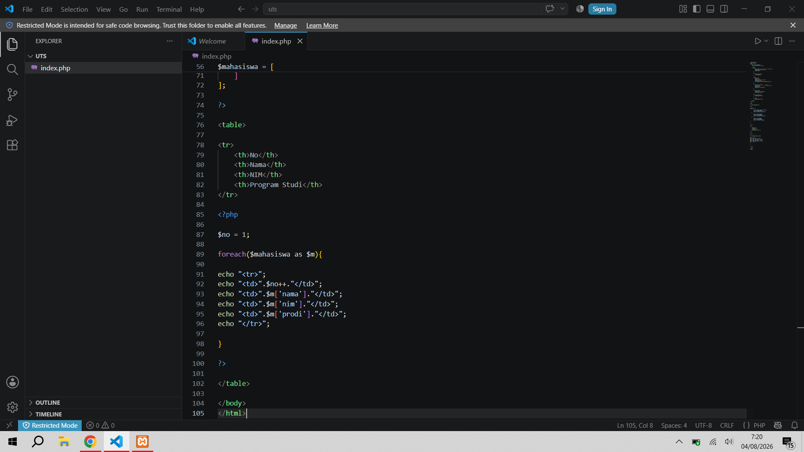
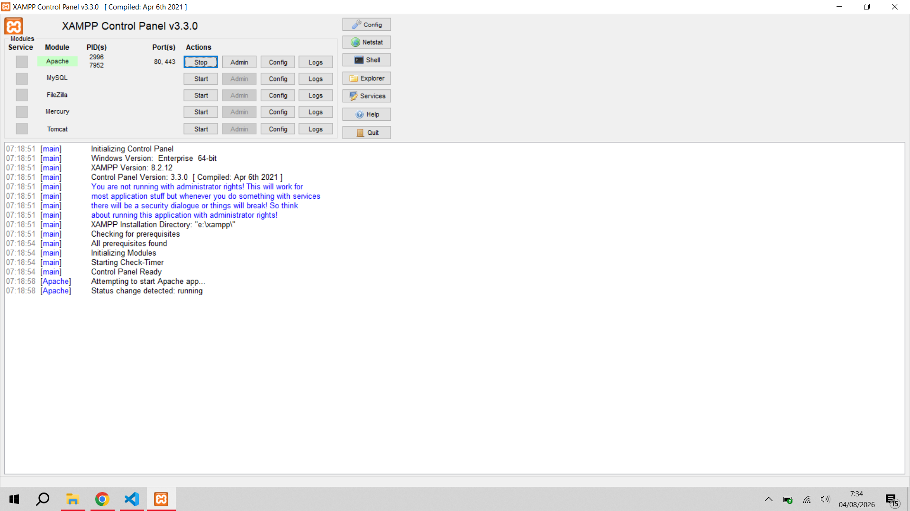

# UTSPemrogramanWeb2

# 1. Struktur HTML
<!DOCTYPE html>
<html lang="id">
<head>
<!DOCTYPE html> menunjukkan bahwa halaman menggunakan HTML5.
<html lang="id"> berarti bahasa halaman adalah Bahasa Indonesia.
<head> berisi informasi halaman seperti judul dan CSS.
2. Judul Halaman
<title>Data Mahasiswa</title>

Bagian ini memberi judul tab browser menjadi Data Mahasiswa.

3. CSS (Style)
Body
body{
    font-family: Arial, Helvetica, sans-serif;
    background:#f4f4f4;
    margin:40px;
}

Fungsinya:

Menggunakan font Arial.
Memberi warna latar abu-abu muda.
Memberi jarak 40 piksel dari tepi halaman.
Judul
h2{
    text-align:center;
    color:#b30000;
}

Fungsinya:

Judul berada di tengah.
Warna tulisan merah tua.
Tabel
table{
    width:70%;
    margin:auto;
    border-collapse:collapse;
    background:white;
}

Artinya:

Lebar tabel 70% dari layar.
Tabel berada di tengah.
Garis tabel menyatu.
Latar tabel putih.
Header Tabel
th{
    background:#c00000;
    color:white;
    padding:12px;
}

Fungsinya:

Header berwarna merah.
Tulisan putih.
Jarak isi sel 12 piksel.
Isi Tabel
td{
    padding:10px;
    border:1px solid #000;
    text-align:center;
}

Artinya:

Isi tabel rata tengah.
Memiliki garis hitam.
Jarak isi lebih rapi.
Warna Selang-seling
tr:nth-child(even){
    background:#f8f8f8;
}

Artinya:

Baris genap diberi warna abu-abu muda supaya tabel lebih mudah dibaca.

Efek Hover
tr:hover{
    background:#ffe5e5;
}

Saat kursor diarahkan ke baris tabel, warnanya berubah menjadi merah muda.

4. Judul Halaman
<h2>DATA MAHASISWA</h2>

Menampilkan tulisan besar:

DATA MAHASISWA

5. Membuat Array Mahasiswa
$mahasiswa = [

Variabel $mahasiswa berisi beberapa data mahasiswa.

Contohnya:

[
    "nama"=>"Bagas Prihantoro Putra",
    "nim"=>"231011400001",
    "prodi"=>"Teknik Informatika"
],

Artinya:

Mahasiswa pertama memiliki:

Nama : Bagas Prihantoro Putra
NIM : 231011400001
Program Studi : Teknik Informatika

Kemudian terdapat data mahasiswa lain seperti:

Andi Saputra
Siti Rahma
dan seterusnya.

Karena setiap mahasiswa memiliki beberapa informasi (nama, nim, prodi), maka disebut array multidimensi.

6. Membuat Tabel
<table>

Membuat tabel HTML.

Header tabel:

<tr>
    <th>No</th>
    <th>Nama</th>
    <th>NIM</th>
    <th>Program Studi</th>
</tr>

Kolom yang ditampilkan yaitu:

No
Nama
NIM
Program Studi
7. Nomor Otomatis
$no = 1;

Variabel $no digunakan untuk membuat nomor urut.

Awalnya bernilai 1.

8. Perulangan Foreach
foreach($mahasiswa as $m){

Artinya:

Program akan mengambil setiap data mahasiswa satu per satu dari array $mahasiswa.

Misalnya:

Perulangan pertama

$m

berisi

Bagas Prihantoro Putra

Perulangan kedua

$m

berisi

Andi Saputra

Dan seterusnya sampai data terakhir.

9. Menampilkan Data
echo "<tr>";

Membuat satu baris tabel.

Kemudian

echo "<td>".$no++."</td>";

Menampilkan nomor urut.

Hasilnya:

1
2
3
4

Operator ++ berarti setelah ditampilkan nilainya bertambah satu.

Selanjutnya

echo "<td>".$m['nama']."</td>";

Menampilkan nama mahasiswa.

echo "<td>".$m['nim']."</td>";

Menampilkan NIM.

echo "<td>".$m['prodi']."</td>";

Menampilkan program studi.

Terakhir

echo "</tr>";

Menutup baris tabel.

10. Hasil Program

Saat program dijalankan melalui XAMPP (misalnya di http://localhost/uts/index.php), tampilannya akan menjadi seperti berikut.

No	Nama	NIM	Program Studi
1	Bagas Prihantoro Putra	231011400001	Teknik Informatika
2	Andi Saputra	231011400002	Teknik Informatika
3	Siti Rahma	231011400003	Sistem Informasi

Tabel memiliki ciri:

Header berwarna merah dengan tulisan putih.
Isi tabel berwarna putih dan abu-abu selang-seling.
Saat kursor diarahkan ke suatu baris, warnanya berubah menjadi merah muda.
Nomor urut dibuat otomatis menggunakan variabel $no.
Kesimpulan

Program ini menggabungkan HTML, CSS, dan PHP untuk membuat halaman web yang menampilkan data mahasiswa secara rapi. HTML digunakan untuk menyusun struktur halaman, CSS mempercantik tampilan tabel, sedangkan PHP mengolah data menggunakan array multidimensi dan perulangan foreach sehingga seluruh data mahasiswa dapat ditampilkan secara otomatis tanpa harus menulis setiap baris tabel secara manual.

